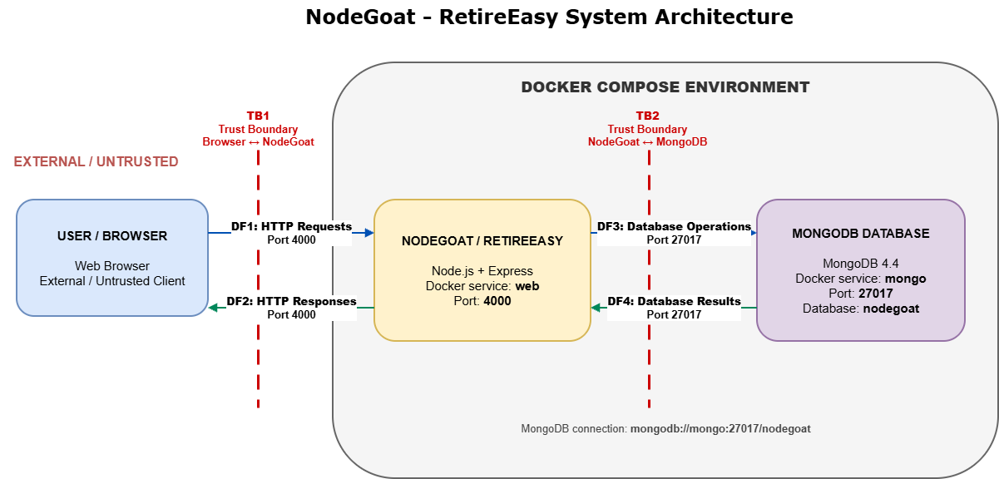

# System Architecture

## 1. Selected Application

The application selected for this DevSecOps project is OWASP NodeGoat. NodeGoat is an intentionally vulnerable open-source Node.js web application designed to demonstrate common web application security weaknesses.

Within NodeGoat, the user-facing application is presented as RetireEasy, an employee retirement savings management system. The application provides a realistic environment in which security threats and vulnerabilities can be identified, demonstrated, remediated, and later checked through automated DevSecOps security controls.

The application is run locally using Docker and consists primarily of a Node.js/Express web application and a MongoDB database.

## 2. Technology Stack

The main technologies identified in the selected NodeGoat repository are:

| Technology | Purpose |
|---|---|
| Node.js | JavaScript runtime used by the web application |
| Express.js | Web framework used to process HTTP requests and application routes |
| MongoDB | Database used to store application data |
| MongoDB Node.js Driver | Allows the NodeGoat application to communicate with MongoDB |
| Express Session | Provides session management for application users |
| Body Parser | Processes data submitted through HTTP requests |
| Swig / Consolidate | Used for rendering the application's HTML views |
| Docker | Builds and runs the application in containers |
| Docker Compose | Starts and connects the web application and MongoDB services |

The supplied Dockerfile uses the `node:12-alpine` base image for the NodeGoat web application, while the Docker Compose configuration uses the `mongo:4.4` image for the database service.

## 3. Main Application Components

The system contains two primary communicating components:

1. NodeGoat / RetireEasy Web Application
2. MongoDB Database

These components run as separate Docker services and communicate through Docker's internal networking.

## 4. NodeGoat Web Application

The web component contains the NodeGoat/RetireEasy application and is implemented using Node.js and Express.

The application's main server entry point is `server.js`. The server initializes the Express application, loads middleware, configures sessions and the application's template engine, loads the application routes, connects to MongoDB, and creates the HTTP server.

The web application is exposed through port `4000`, allowing a user to access the application from a browser using:

`http://localhost:4000`

The web Docker image is built from the project's `Dockerfile`. The Dockerfile uses a multi-stage build based on `node:12-alpine`, installs the production Node.js dependencies and copies the application into the final container. The final container is configured to run as the non-root `node` user and exposes port `4000`.

## 5. MongoDB Database

MongoDB provides the database layer for the NodeGoat application.

The MongoDB database runs as a separate Docker Compose service named `mongo`. The Compose configuration uses the `mongo:4.4` Docker image and exposes MongoDB's standard port `27017` to the other services in the Docker environment.

The web application receives the following MongoDB connection URI through its Docker Compose environment configuration:

`mongodb://mongo:27017/nodegoat`

In this connection string:

- `mongodb://` specifies the MongoDB protocol.
- `mongo` is the Docker Compose service name of the MongoDB container.
- `27017` is the MongoDB service port.
- `nodegoat` is the database name.

The application's `server.js` uses the MongoDB client to establish the database connection before handling the application's normal operation.

## 6. Containerisation Approach

Docker is used to provide a consistent and isolated environment for running NodeGoat.

The project contains a `Dockerfile` that defines how the NodeGoat web application image is built. Docker Compose is then used to coordinate the complete application.

The `docker-compose.yml` file defines two services:

- `web` — the NodeGoat/RetireEasy web application.
- `mongo` — the MongoDB database.

The `web` service is built using the project's Dockerfile and maps port `4000` on the host computer to port `4000` in the application container.

The `mongo` service runs MongoDB 4.4 and makes port `27017` available for communication between the application and database containers.

The web service uses the MongoDB service name `mongo` in its connection URI, allowing the two services to communicate through the Docker Compose network.

As a result, the complete local application can be started using Docker Compose and accessed through a web browser without requiring MongoDB to be installed directly on the host operating system.

## 7. System Data Flows

The NodeGoat system contains two primary communication paths: communication between the user's browser and the NodeGoat web application, and communication between the NodeGoat web application and MongoDB.

### 7.1 Browser to Web Application

Users interact with RetireEasy through a web browser. The browser communicates with the NodeGoat web application using HTTP through port `4000`.

The general request flow is:

1. The user performs an action in the browser, such as opening a page, submitting a form, or signing in.
2. The browser sends an HTTP request to the NodeGoat application.
3. Express receives the request.
4. The request passes through configured middleware such as body parsing and session handling.
5. The appropriate application route processes the request.
6. The application generates an HTTP response and sends it back to the user's browser.

Therefore, the first main data flow is:

`User/Browser <-> HTTP on Port 4000 <-> NodeGoat Web Application`

### 7.2 Web Application to MongoDB

When an application operation requires stored information, NodeGoat communicates with the MongoDB database.

The Docker Compose configuration provides the application with the following database connection URI:

`mongodb://mongo:27017/nodegoat`

The NodeGoat server establishes the MongoDB connection using the MongoDB client. The database connection is then made available to the application's routes.

The general database flow is:

1. A request reaches the NodeGoat application.
2. An application route determines that stored data must be read or modified.
3. NodeGoat communicates with the MongoDB service through the Docker network.
4. MongoDB processes the database operation.
5. The result is returned to the NodeGoat application.
6. NodeGoat uses the result to produce a response for the user.

Therefore, the second main data flow is:

`NodeGoat Web Application <-> MongoDB queries/results on Port 27017 <-> MongoDB Database`

### 7.3 End-to-End Request Flow

A typical end-to-end interaction can therefore be represented as:

`User -> Browser -> NodeGoat Web Application -> MongoDB -> NodeGoat Web Application -> Browser -> User`

Not every request requires database access. Requests for static resources or operations that do not need stored data may be handled by the web application without communicating with MongoDB.

## 8. Trust Boundaries

A trust boundary represents a point where data moves between components or environments with different levels of trust or security responsibility. Information crossing a trust boundary should not automatically be considered trustworthy and appropriate security controls should be applied.

### 8.1 TB1 - User Browser to NodeGoat Web Application

The primary trust boundary exists between the user's web browser and the NodeGoat web application.

The browser operates outside the NodeGoat application environment and communicates with the web application using HTTP through port `4000`. Because requests originate from a client that may be controlled or manipulated by a user, information received across this boundary must be treated as untrusted input.

Information crossing this boundary may include:

- Login credentials
- Contribution percentage values
- Asset allocation threshold values
- Memo content
- Profile and personal information
- Stock research input
- URL and query parameters
- Session identifiers and cookies

The main data flows crossing this trust boundary are:

- Browser to NodeGoat HTTP requests
- NodeGoat to Browser HTTP responses

Relevant security controls at this boundary include authentication, authorization, input validation, output encoding and secure session management.

### 8.2 TB2 - NodeGoat Web Application to MongoDB

A second trust boundary exists between the NodeGoat web application and the MongoDB database.

The NodeGoat web application and MongoDB run as separate Docker Compose services and have different responsibilities. The web application performs application logic and handles user requests, while MongoDB stores application data.

The NodeGoat application communicates with MongoDB through the Docker network using:

`mongodb://mongo:27017/nodegoat`

Information crossing this boundary may include:

- User account records
- Retirement and contribution information
- Asset allocation data
- Profile and financial information
- Database queries
- Database query results

The main data flows crossing this trust boundary are:

- NodeGoat to MongoDB database operations
- MongoDB to NodeGoat query results

Relevant security controls at this boundary include safe database query construction, server-side input validation, appropriate authorization and controlled database access.

## 9. Architecture Diagram

The following diagram presents the main NodeGoat components, Docker Compose services, communication paths, ports, data flows and identified trust boundaries.

